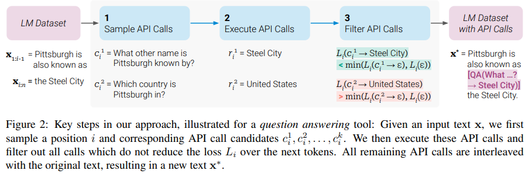

</img>

## Toolformer - Pytorch (wip)

Implementation of <a href="https://arxiv.org/abs/2302.04761">Toolformer</a>, Language Models That Can Use Tools, by MetaAI

## Appreciation

- <a href="https://stability.ai/">Stability.ai</a> for the generous sponsorship to work and open source cutting edge artificial intelligence research

- <a href="https://github.com/conceptofmind">Enrico</a> for getting the ball rolling with the initial commit of different tools!

- Thanks goes out to ChatGPT for doing all the regular expressions in this repository for parsing the functions and parameters for the API calls. I am terrible at regular expressions, so this was enormous help from the AI (with no hitches, it was perfect).

## Install

```bash
$ pip install toolformer-pytorch
```

## Usage

Example usage with giving language models awareness of current date and time.

```python
import torch
from toolformer_pytorch import Toolformer, PaLM

# simple calendar api call - function that returns a string

def Calendar():
    import datetime
    from calendar import day_name, month_name
    now = datetime.datetime.now()
    return f'Today is {day_name[now.weekday()]}, {month_name[now.month]} {now.day}, {now.year}.'

# prompt for teaching it to use the Calendar function from above

prompt = f"""
Your task is to add calls to a Calendar API to a piece of text.
The API calls should help you get information required to complete the text.
You can call the API by writing "[Calendar()]"
Here are some examples of API calls:
Input: Today is the first Friday of the year.
Output: Today is the first [Calendar()] Friday of the year.
Input: The president of the United States is Joe Biden.
Output: The president of the United States is [Calendar()] Joe Biden.
Input: [input]
Output: 
"""

data = [
    "The store is never open on the weekend, so today it is closed.",
    "The number of days from now until Christmas is 30",
    "The current day of the week is Wednesday."
]

# model - here using PaLM, but any nn.Module that returns logits in the shape (batch, seq, num_tokens) is fine

model = PaLM(
    dim = 512,
    depth = 2,
    heads = 8,
    dim_head = 64
).cuda()

# toolformer

toolformer = Toolformer(
    model = model,
    model_seq_len = 256,
    teach_tool_prompt = prompt,
    tool_id = 'Calendar',
    tool = Calendar
)

data_with_api_calls = toolformer.generate_data_with_api_calls(data)

filtered_data, filtered_data_with_api_calls = toolformer.filter_and_keep_only_first_api_call(data, data_with_api_calls)

data_with_api_responses = toolformer.make_api_calls(filtered_data_with_api_calls)

filtered_results = toolformer.filter_by_api_responses(
    filtered_data,
    filtered_data_with_api_calls,
    data_with_api_responses
)

# then finetune with token ids at
# -> filtered_results.filtered_tokens_without_api_response
# complete this with toolformer.finetune(filtered_results)

```

The main novelty of the paper is defining a fitness score for the outputs from a transformer instructed to insert API calls. The score is used to filter the sampled outputs for finetuning the transformer to make API calls that decreases perplexity of the text that follows it.

```python
import torch

from toolformer_pytorch import (
    Toolformer,
    PaLM,
    filter_tokens_with_api_response
)

# model

palm = PaLM(
    dim = 512,
    num_tokens = 20000,
    depth = 2,
    heads = 8,
    dim_head = 64
).cuda()

# mock some tokens

mock_start_pos = 512
mock_api_call_length = 10
mock_api_start_id = 19998
mock_api_stop_id = 19999

tokens = torch.randint(0, 20000, (10, 1024)).cuda()
tokens_with_api_response = torch.randint(0, 20000, (10, 1024)).cuda()
tokens_without_api_response = torch.randint(0, 20000, (10, 1024)).cuda()

tokens_with_api_response[:, mock_start_pos] = mock_api_start_id
tokens_with_api_response[:, mock_start_pos + mock_api_call_length] = mock_api_stop_id

tokens_without_api_response[:, mock_start_pos] = mock_api_start_id
tokens_without_api_response[:, mock_start_pos + mock_api_call_length] = mock_api_stop_id

# filter

filtered_results = filter_tokens_with_api_response(
    model = palm,
    tokens = tokens,
    tokens_with_api_response = tokens_with_api_response,
    tokens_without_api_response = tokens_without_api_response,
    filter_threshold = 1.,
    api_start_token_id = mock_api_start_id,
    api_end_token_id = mock_api_stop_id
)
```

To invoke the tools on a string generated by the language model, use `invoke_tools`

```python
from toolformer_pytorch import invoke_tools

def inc(i):
    return i + 1

def dec(i):
    return i - 1

function_registry = dict(
    inc = inc,
    dec = dec
)

text = 'make the following api calls: [inc(1)] and [dec(2)] and [ignored(3)]'

invoke_tools(function_registry, text)

# make the following api calls: [inc(1) → 2] and [dec(2) → 1] and [ignored(3)]
```

## Todo

- [x] create custom generate function for palm that can do external API calls
    - [x] allow for generating tokens at different cursor indices
    - [x] api token (which was left and right brackets in paper) needs to be customizable
    - [ ] allow for customizing how to fine handling errors in function name, parameters, or execution and output
- [ ] Toolformer should eventually calculate all statistics (how many properly sampled, filtered out by different criterias, the distribution of scores as well as how many were rejected) before the final fine-tuning
- [ ] do end-to-end training in `Toolformer`
    - [x] doing the prompting and bootstrapping the data
    - [x] prefiltering of bootstrapped data followed by api calls and then another round of filtering
        - [ ] keep track of all stats
    - [ ] take care of fine-tuning, with the interleaving of datasets + optimizer hyperparams
- [ ] hook up gpt-j
- [ ] test for a simple calculator eval dataset

## Citations

```bibtex
@inproceedings{Schick2023ToolformerLM,
    title   = {Toolformer: Language Models Can Teach Themselves to Use Tools},
    author  = {Timo Schick and Jane Dwivedi-Yu and Roberto Dessi and Roberta Raileanu and Maria Lomeli and Luke Zettlemoyer and Nicola Cancedda and Thomas Scialom},
    year    = {2023}
}
```

```bibtex
@article{Gao2022PALPL,
    title   = {PAL: Program-aided Language Models},
    author  = {Luyu Gao and Aman Madaan and Shuyan Zhou and Uri Alon and Pengfei Liu and Yiming Yang and Jamie Callan and Graham Neubig},
    journal = {ArXiv},
    year    = {2022},
    volume  = {abs/2211.10435}
}
```

*Reality is that which, when you stop believing it, doesn't go away.* – Philip K. Dick.
